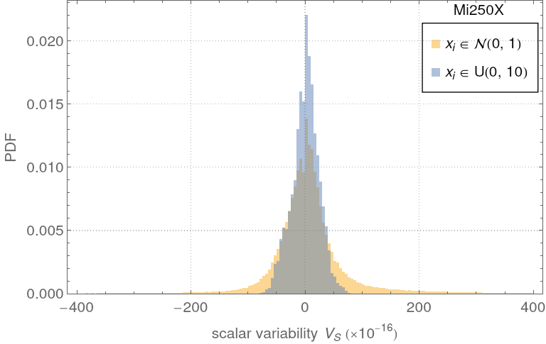

# Introduction

This repository contains additional instructions to build and use the codes used
for the section III and IV of the paper titled "Impacts of floating-point
non-associativity on reproducibility for HPC and deep learning applications".

# Parallel sum

The following section expands the section III of the paper. It gives more
details about building and executing the code, the data file format, and results
that could not find their place in the main text.

## code

The c++ code used for Sec.III of the paper can be found in the code directory.
The compilation only requires CMake, CUDA or HIP. To compile it, clone the
repository and use the command

```bash
cmake -B build -S . -DREDUCE_USE_CUDA -DCMAKE_CUDA_ARCHITECTURES=70 
```
for support of the V100 or 
```bash
cmake -B build -S . -DREDUCE_USE_HIP -DCMAKE_HIP_ARCHITECTURES=gfx90a+xnacks 
```

the AMD Mi250X GPU. The variable `CMAKE_CUDA_ARCHITECTURES` or
`CMAKE_HIP_ARCHITECTURES` can be set to different GPU families (80 for the A100,
90 for the H100 and GH200 GPUs).

Double precision atomic operations are supported on the Mi250X GPU but require
an additional compiler flag enabling unsafe math optimizations. The `make`
command will generate one executable named `test_reduce`. The executable has
several options controlling the calculations parameters. `test_reduce --help`
will return the full list of all available options. All options have default values. 

We run the following commands for the article 
```bash
./test_reduce -S 1000000 --max_reduction_size 1000000 -A 10.0 -d uniform
./test_reduce -S 1000000 --max_reduction_size 1000000 -A 10.0 -d normal
./test_reduce -S 1000000 --max_reduction_size 1000000 -A 10.0 -d uniform -c -0.5
./test_reduce -S 500000 --max_reduction_size 1000000 -A 10.0 -d uniform --atomic_only
```
The executable generates csv files containing results of the variability
for the different distributions. The name of the distribution and the GPU types
are included in the data file name. The format of the files containing the
variability data is given by
```
10,0.0000000000000000e+00,0.0000000000000000e+00,-0.0000000000000000e+00,,...
100,0.0000000000000000e+00,0.0000000000000000e+00,-0.0000000000000000e+00,...
...
```

Each line starts with the sum length followed by the measured variability.

The timings data are stored in a separate `csv` file, each line giving the
timings for different values of the parameters and name of the kernel. The
line format is given by

```
implementation,block size,grid size,timing mean value,timing standard deviation
```

For instance the following line gives the parameters and timings for the `atomic_only` implementation of the sum. 

```
atomic_only,512,32768,0.872566850400000,0.000070762366890
```

The Mathematica directory contains mathematica files to explore the variability
data and generate the figures included in this material and the paper. The
variability data used for the article can be found in the data directory. 

## Simulating the behavior of atomic operations

Atomic operations on GPU provide a mean for multiple threads to update the same
local area in memory. Each atomic operation is serialized and executed in a
un-specified order by a dedicated unit of the memory controller. It is a major
problem because floating point arithmetic is non associative. Summing three
floating point numbers `a`, `b`, `c` with two atomicAdd can return any of the three
outcomes $(a + b) + c$ or $(a + c) + b$ or $(b + c) + a$ which are potentially
different due to rounding errors.

Calculating the sum of an array with atomic operations is equivalent to
permuting the elements of the array before calculating the sum with a
deterministic implementation. It is better illustrated with the following python
code that computes the sum of array before and after randomly permuting the
elements.
```python
 import numpy as np
 from numpy.random import MT19937, RandomState, SeedSequence
 rs = RandomState(MT19937(SeedSequence(123456789)))
 length = 100
 print("Array size   S - S_p    Variability")
 for i in range(1, 6):
     x = rs.standard_normal(length)
     sum_x = np.sum(x)
     for i in range(1,10):
         res = sum_x - np.sum(np.random.permutation(x))
         Vs= res / sum_x
         print(f"{length:8d}: {res:.15e} {Vs:.15e}")
     length *= 10
```

Running this code on a laptop will return this output
```
Array size:    S - S_p                   Variability
        100    0.000000000000000e+00    -0.000000000000000e+00
        100    0.000000000000000e+00    -0.000000000000000e+00
        100    1.776356839400250e-15    -1.429110877916860e-16
        100    1.776356839400250e-15    -1.429110877916860e-16
        100    3.552713678800501e-15    -2.858221755833720e-16
        100    0.000000000000000e+00    -0.000000000000000e+00
        100    -1.776356839400250e-15    1.429110877916860e-16
        100    1.776356839400250e-15    -1.429110877916860e-16
        100    0.000000000000000e+00    -0.000000000000000e+00
       1000    -1.243449787580175e-14    -2.613464529486963e-15
       1000    -5.329070518200751e-15    -1.120056226922984e-15
       1000    3.552713678800501e-15    7.467041512819895e-16
       1000    0.000000000000000e+00    0.000000000000000e+00
       1000    -4.440892098500626e-15    -9.333801891024869e-16
       1000    -7.105427357601002e-15    -1.493408302563979e-15
       1000    1.776356839400250e-15    3.733520756409948e-16
       1000    0.000000000000000e+00    0.000000000000000e+00
       1000    1.776356839400250e-15    3.733520756409948e-16
      10000    3.552713678800501e-15    -1.291404928402212e-16
      10000    1.065814103640150e-14    -3.874214785206635e-16
      10000    -1.065814103640150e-14    3.874214785206635e-16
      10000    2.486899575160351e-14    -9.039834498815481e-16
      10000    -3.552713678800501e-15    1.291404928402212e-16
      10000    -4.618527782440651e-14    1.678826406922875e-15
      10000    3.907985046680551e-14    -1.420545421242433e-15
      10000    1.065814103640150e-14    -3.874214785206635e-16
      10000    1.421085471520200e-14    -5.165619713608847e-16
     100000    5.684341886080801e-14    1.412955848089280e-16
     100000    1.705302565824240e-13    4.238867544267839e-16
     100000    1.705302565824240e-13    4.238867544267839e-16
     100000    5.684341886080801e-14    1.412955848089280e-16
     100000    5.684341886080801e-14    1.412955848089280e-16
     100000    1.136868377216160e-13    2.825911696178559e-16
     100000    1.705302565824240e-13    4.238867544267839e-16
     100000    2.273736754432321e-13    5.651823392357118e-16
     100000    2.273736754432321e-13    5.651823392357118e-16
    1000000    3.126388037344441e-13    1.704554731445489e-15
    1000000    5.115907697472721e-13    2.789271378728982e-15
    1000000    3.694822225952521e-13    2.014473773526487e-15
    1000000    3.126388037344441e-13    1.704554731445489e-15
    1000000    2.842170943040401e-13    1.549595210404990e-15
    1000000    6.821210263296962e-13    3.719028504971976e-15
    1000000    5.115907697472721e-13    2.789271378728982e-15
    1000000    4.263256414560601e-13    2.324392815607485e-15
    1000000    5.115907697472721e-13    2.789271378728982e-15
```

The error grows with the array size and can reach values that are above the
threshold of many correctness tests found in the quantum package CP2K. 

## Details about the different implementations

### CUDA programming and terminology

This section defines some relevant terminology for GPU programming that will be
used in this README. Far more information about GPU programming in general can
be found in the CUDA manual. 

A thread is the smallest unit of execution in CUDA. Each thread
executes a kernel function independently in a SIMD manner. Groups of threads are
organized into blocks which can be arranged in a one-dimensional,
two-dimensional, or three-dimensional structure. Threads within the same block
can share data through shared memory and synchronize their execution including
data read/ writes with synchronization barriers. A warp is a group of 32 threads
for NVIDIA GPUs and 64 threads for AMD GPUs that execute instructions in
lock-step on the GPU. All threads in a warp execute the same instruction
simultaneously. If threads in a warp diverge (e.g., due to a conditional
branch), the warp will serially execute each branch path taken, which can reduce
efficiency. This is known as warp divergence.

There are few variables that will be used in the different listings.
Threads and blocks are indexed by the variables `threadIdx` and `blockIdx`
respectively. The block dimension which describes the number of threads inside
a block is described by the variable `blockDim`, while the number of block is
given by `gridDim`.

the `__syncthreads()` instruction allows the synchronization of all threads
within a block. 

### Simple implementations of the parallel sum

We present two very simple implementations from a programming perspective of the
sum on a GPU. They do not need any explicit synchronization barrier and the code
is nearly identical to a CPU implementation. The code  is given by
```c++
__global__ void reduce_single_thread(const double *const sdata, const int size, double *res) {
     if (blockIdx.x != 0)
         return;
        
     const int tid = threadIdx.x;
     double sum = 0.0;
     if (tid == 0)
         for (int i = 0; i < size; ++i)
             sum += sdata[i];
     res[0] = sum;
}

__global__ void reduce_atomic_only(double *sdata, int size, double *res) {
    if (blockIdx.x != 0)
        return;

    const int tid = threadIdx.x + blockIdx.x * blockDim.x;
    atomicAdd(res, sdata[tid]);
}
```

In the first function `reduce_single_thread`, the sum is calculated with one
thread using the recursive algorithm. This code is deterministic but is very
slow as it does not exploit the parallelism offered by GPU.

The second implementation uses the `atomicAdd` instruction to update the
accumulator. The code is also very simple from a programming standpoint (only three
lines) and the instruction scheduling is parallel but atomic instructions are
serialized in practice making this code sequential. Moreover the order of the
atomic instructions is runtime dependent which means that the
`reduce_atomic_only` implementation is not determinisitic.

These two implementations should not be used for large reductions as they are
very slow, up to 4 orders of magnitude slower than more advanced implementations
of the parallel sum. Many programmers still use them as bilding blocks for more
complex kernels because of their simplicity. For instance the recursive sum is
used as a first stage of the reduce function found in the CUB library (and our
code) to improve the use of memory bandwidth. The floating point `atomicAdd`
instruction should be avoided all together because its execution is not
deterministic.

### The pairwise algorithm and its implementation on GPU

The pairwise summation method is particularly well suited for GPU. In this
method, the first half of an array of size `N` is summed to its second half in a
pairwise fashion. The process is repeated recursively log<sub>2</sub>(n) times
using the result of the previous iteration as input. Each stage of the process
is easily parallelizable but a global synchronization barrier is needed between
each stage to insure memory coherency. More information about its stability and
numerical properties can be found
[here](https://en.wikipedia.org/wiki/Pairwise_summation)

GPU do not have global synchronization barrier at the grid level only within a
thread block. To solve this issue, we split the initial array in smaller
arrays, a method called blocking. Each thread block apply the pairwise algorithm to the block of data and write the result back to global memory. The following code
is a simple implementation of the block reduction using shared memory to
improve data locality and latency. 
```c++
/* apply a block reduction on a array of blockDim.x elements on a thread block (blockDim.x >= 64) */

__device__ void block_reduce(double *smem, *double &partial_sum)
{
    /* data a loaded in shared memory before calling the function */
    
    /* 
        Apply the pairwise method. The number of active threads is halved 
        between iteration. 
    */
    for (offset = blockDim.x / 2; offset > 0; offset  /= 2) {
        /* the number of active threads is halved after each iteration */
        if (threadIdx.x < offset) 
            smem[threadIdx.x] += smem[threadIdx.x + offset];
        /*  synchronization barrier */
        __syncthreads();
    }
    
    if (threadIdx.x == 0)
        partial_sum = smem[0];
}

__global__ void pairwise_reduce(const double *data, const int size, double *partial_results) {
    /* compute the global index of the thread */
    const int tid = threadIdx.x + blockDim.x * blockIdx.x;

    extern __shared__ double smem[];
    
    /* Split the data in smaller chunk. The block only only on one chunk */
    if (tid >= size)
        smem[threadIdx.x] = 0.0;
    else
        smem[threadIdx.x] = data[tid];
    
    /* Wait for all thread to update shared memory */
    __syncthreads();
    
    /* apply the block reduction */
    double partial_sum = 0.0;
    block_reduce(smem, partial_sum);
    
    if (threadIdx.x == 0)
        partial_results[blockIdx.x] = partial_sum;
}
```
The function `pairwise_reduce` only returns the partial sums and requires a global synchronization barrier to ensure that all partial sums are available before calculating the final sum. We describe three different methods to implement the second stage and the synchronization barrier. The first method uses the `atomicAdd` instruction to update the accumulator instead of copying the partial results back to memory after replacing these lines of code
```
    if (threadIdx.x == 0)
        partial_results[blockIdx.x] = partial_sum;
```
with 
```
    if (threadIdx.x == 0)
        atomicAdd(partial_results, partial_sum);
```
in the `pairwise` function. This is The (AO) method described in the main text. It is again very simple replacement as the full sum is given by the first element of the `partial_results` array but the function is not deterministic for floating point numbers. 

Two kernels K<sub>1</sub> and K<sub>2</sub> launched on the same stream will run sequentially following the submission order. This property can be used at our advantage to simulate a global synchronization barrier between different parts of the code but it requires two kernels launches to be effective. The second kernel can be anything from an other pairwise reduction to a memory transfer between GPU and CPU. We choose the second method and copy all partial results back to CPU before calculating the final sum on CPU. It is the TPRC method described in  the main text. The TPRC method is deterministic by construction.

The last method is a bit more advanced and prone to error if implemented incorrectly. It uses the `__threadfences` instruction and an atomic operation to increment a counter. The `__threadfences` instruction **only** blocks the calling thread until all write issued before the call are finished and then broadcast the final state of the memory operation to all the other running threads. It is not a synchronization barrier though as other threads can still run in parallel. The code is given by
```c++
__device__ int retirementCount = 0;

__global__ void reduce_gpu_full(double *sdata, int size, double *res) {
    int tid = threadIdx.x + blockIdx.x * blodkDim.x;
    
    extern __shared__ double smem[];
    
    /* Split the data in smaller chunk. The block only only on one chunk */
    if (tid >= size)
        smem[threadIdx.x] = 0.0;
    else
        smem[threadIdx.x] = data[tid];
    
    /* Wait for all thread to update shared memory */
    __syncthreads();
    
    /* apply the block reduction */
    double partial_sum = 0.0;
    block_reduce(smem, partial_sum);

    if (threadIdx.x == 0)
        partial_results[blockIdx.x] = partial_sum;

    __threadfences();

    bool __shared__ amLast = false;
    if (threadIdx.x == 0) {
        int prev = atomicInc(&retirementCount, gridSize.x);
        amLast = (prev == (gridDim.x - 1));
    }
    __syncthreads();

    if (amLast) {
        if (threadIdx.x == 0) {
            double sum = 0;
            for (int i = 0; i < gridDim.x; i++)
                sum += res[i];
            res[0] = sum;
        }
    }
}
```
The last block incrementing the `retirementCount` counter is responsible for
calculating the final sum. Which block does computation is runtime dependent but
this kernel always returns a deterministic result undependently of the 
execution order of the `atomicInc` instruction. This technique is used in the
SPS method described in the main text. The CUB and hipcub libraries also use
similar techniques in their sum function.

### Code optimization

The C++ code included in this repository contains all implementations described in the paper. It also contains generic optimizations to the block reduction algorithm. We invite the reader to consult Mark Harris (NVIDIA) [presentation](https://developer.download.nvidia.com/assets/cuda/files/reduction.pdf) to get insights about the optimization of the parallel sum. The reduction example codes found [here](https://github.com/NVIDIA/cuda-samples/tree/master/Samples/2_Concepts_and_Techniques/reduction) and [here](https://github.com/NVIDIA/cuda-samples/tree/master/Samples/2_Concepts_and_Techniques/threadFenceReduction) also contains information about optimizations not covered by the presentation.

## Statistical properties of the non-deterministic summation

### Scalar variability

The scalar variability defined in the main text is very similar to the relative
error encountered in error analysis. The scalar variability and relative errors
measure both the difference between two implementations of the same operator, in
our case the sum, but one only depends on the implementations (the relative
error) while the other is a dynamical quantity. They are both linked to rounding
error and non associativity of the floating point arithmetic.

The relative error is a static quantity because the order of the operations is
usually fixed during the analysis and in some sense may describe the properties
of deterministic implementations of the operator under study. The variability on
the other hand measures the impact of time dependent random permutations of the
same arithmetic operations. A typical example of such operation would
be the atomicAdd instruction on GPU. A series of atomicAdd instructions will run
sequentially but the order of execution runtime dependent. 

### Parameters to compute the scalar variability

To compute the probability density functions of the scalar variability, we
generate a set of 100 arrays of 1 million 64 bits floating point numbers taken
from the uniform distribution. We use the SPS and SPA methods to compute the
deterministic and the non deterministic sum respecitively. The variability is
then calculated 100000 times for each of these arrays generating a total sample
size of 1 million values. We repeat the same protocol with the normal
distribution of zero mean and standard deviation of 1. The array size follows a
geometric progression from 10 to 10000000 FP64 numbers with a step size of 10.

We choose the kernels parameters to maximize the number of atomic operations. We
fixed the thread block size to 64 and computed the number of blocks using the
formula $(N - 128 - 1) / 128$. With $N = 10000000$, we find that the number of atomic
operations is equal to 78126 when rounded to the closest largest integer. 

A mathematica file is included in the repository for calculating the histogram
and PDF associated to the scalar variability. 

### Kullback–Leibler divergence 

The
[Kullback-Leibler](https://en.wikipedia.org/wiki/Kullback%E2%80%93Leibler_divergence)
divergence criterion is a positive quantity measuring how close two probability
density functions $P(x)$ and $Q(x)$ are close to each other. It is given by 
```math
D_\text{KL}(P \parallel Q) = \sum_{ x \in \mathcal{X} } P(x)\ \log\left(\frac{\ P(x)\ }{ Q(x) }\right)
```
The KL divergence is zero if the two distributions are identical, non zero if
they are different. It is possible to compute the mimimal value of the KL
criterion analytically when at least one of the distribution is normal. It is equal to 
$(\log(2\pi) + 1) / 2 + \log(\sigma) - S_P$, where $\sigma$ is the variance of the
PDF $P(x)$ and $S_P$ its Shannon entropy. 

### Variability probability density functions

We computed the probability density functions of the scalar variability on the
V100, GH200, and Mi250X gpus. The figure below shows the PDF of the GH200 vs
V100 and Mi250X vs V100 plotted on the same axis for a set of uniformly
distributed floating point numbers. 
<p align="center">
 
</p>
All PDF look similar to the PDF of the
variability calculated on the V100 with the grey area showing the overlap
between the different distributions. The PDF of the GH200 are particularly close
to the V100's while the pdf of Mi250X seem to be mirrored compared to the V100. 
The overall shape does not really depend on the GPU family at least for the
algorithms we tested.

The figures below give the pdf of the variability of uniformly and normally
disitrbuted FP64 numbers for the three families of GPU we tested. 
<p align="center">    </p>

The variability strongly depends on the initial distribution of data. Uniformly
distributed data show the smallest variability and the normally distributed data
the largest of the two for all three GPU families we tested. This supports the
idea that the pdf strongly depends on the data distribution and that it is not
possible to make any generic statement about the pdf of the variability itself.

Since all three figures are similar, we only plot the dependence of max $|V_s|$
as a function of the array size for the V100 GPU with a power law of the form
$\beta N^\alpha$. 

<p align="center"> 
 
</p>

Fitting the data with the power law show that the fitting coefficients depend on
the initial data distribution. We find that max $|V_s|\propto \sqrt{N}$ for
uniformly distributed data while the exponent is higher for normally distributed
data. These coefficients depend on the details of the implementation as well.
Surpringly even a small number of atomic operations can be enough to have an
impact down afterwards. 

It is often assumed that the variability induced by atomic operations can be
treated as an additional source of gaussian noise but we could find any evidence
reporting this in the litterature. To test this, we used the KL divergence
criterion and found that all PDFs are well described by a gaussian distribution
supporting the idea of variability is gaussian. 

However we also found that changing the SPA to the AO method gives a multinodal
distribution not a gaussian distribution as previously found. 

The initial data used in this section are all well distrbuted data. Data
generated from simulations will have different distributions or often will be ill
conditioned making the scalar variability even higher. 

## Performances comparison


### Parameters for the performance comparison

To measure the timings of the different implementations of the parallel sum
included in the `c++` code, we generate a set of 100 arrays of 4 M uniformly
distributed floating point numbers and compute the time required to calculate
the sum for all implementations for different values of the kernels parameters
$N_t$ and $N_B$. $N_t$ can only take values up to `1024`. The hardware
limitation for $N_b$ have no practical impact some these tests. We do not
optimize the code for each specific GPU either.

All implementations are tested for $N_t = 64, 128, 256, 512$. The number of
block N_b follows a geometric progression with a step of 4. It is automatically
limited to $(N + 2 N_t - 1) / 2 N_t$ when $N_b$ is above this value.

The timings are averaged over 10 runs to gather statistics. 

### results

# PyTorch Tests

This directory holds all the PyTorch operation benchmark sweeps and the training and inference non-determinism tests.

## Repo organization

Please note the repository is organized as follows, with the operator benchmarks presented in the paper in `test-suite/paper-results` and the full sweep in the parent `test-suite`
```
test-suite/
│ └── data/
│ ├── benchmark and plotting scripts
├── paper-results/
  └── data
  ├── benchmark and plotting scripts
```


## Installation

Use the package manager [pip](https://pip.pypa.io/en/stable/) to install the relevant packages. Please ensure you are in a virtual environment using conda, python venv etc. It is ideal to have a GPU to run these experiements, however this can be done on the CPU

```bash
pip install -r requirements.txt
```

## Usage

```sh
# For the full operator sweep, results will be stashed in csvs in `./data`
python scaffold.py

# For the train and inference test, figures will be plotted and saved in `test-suite`
python train.py

# To analyze data, please refer to operations_analysis.ipynb

# regenerate paper results, for the selected index_add and scatter_reduce operations. Data is stored in `paper-results/data`

python /paper-results/scaffold.py

# To analyze data, please refer to generate_operation_figures.ipynb
```

Note, to add your own sets of hyperparameters to test for non-determinism, please head to the relevat scaffold.py file and edit the relevant operation hyperparameters and global variables in the main body

```python

if __name__ == "__main__":

    deterministic = False
    device = gpu
    iterations = 1000
    
    conv2d_dimensions = {
        "batch_size": list([1, 2]),
        "dim": list([(3, 256, 256), (3, 512, 512), (3, 1024, 1024)]),
        "kernel_size": list([(3, 3), (5, 5), (7, 7)]),
        "stride": list([1, 3, 5]),
        "padding": list([0, 1]),
        "dilation": list([1, 2, 5]),
        "groups": list([1, 2, 3]),
        "dtype": list([torch.float32]), # TODO: check why relative error is NaN with fp16
    }
   
    print("=========================== Conv2d benchmark ======================================") 
    benchmark(
        op = nn.Conv2d,
        weight_dist = nn.init.normal_,
        data_dist = nn.init.normal_, 
        dimensions = conv2d_dimensions,
        hyperparameters = ConvParams(),
        device = device,
        deterministic = deterministic,
        autograd = False,
        dtype = None,
        iterations = iterations,
    )
```

## Contributing

Pull requests are welcome. For major changes, please open an issue first
to discuss what you would like to change.

Please make sure to update tests as appropriate.

# Hardware 

