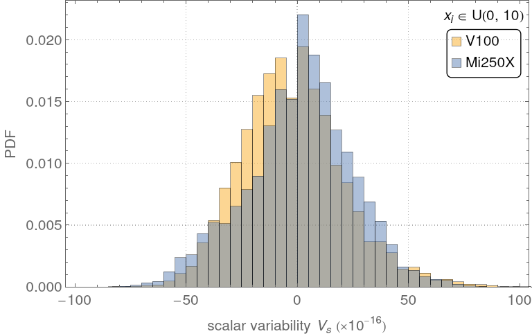
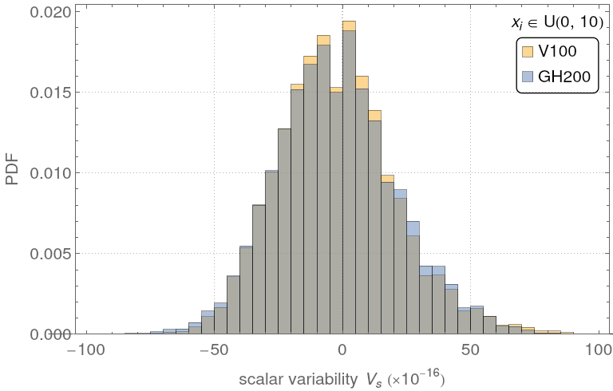
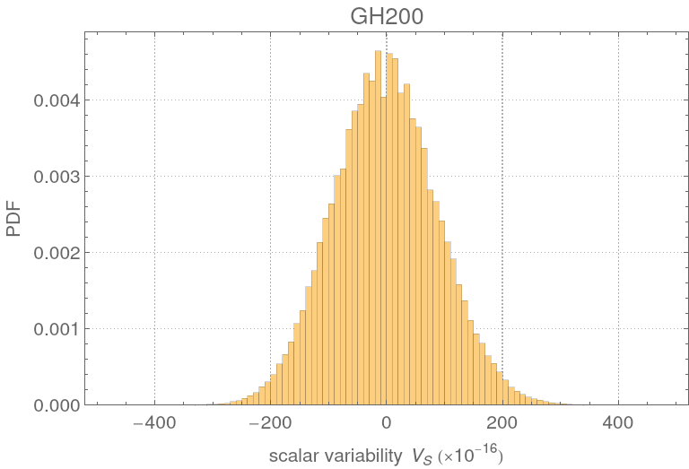

# Introduction

This repository contains additional instructions to build and use the codes used
for the section III and IV of the paper titled "Impacts of floating-point
non-associativity on reproducibility for HPC and deep learning applications".

All codes are under the BSD license.

# Parallel sum

The following section expands the section III of the paper. More
details about building and executing the code are provided as well as results
that we could not include in the main due to the lack of space. This section also
explains some generic methods to avoiding floating atomic instructions. We take
the example of  the parallel sum for its simplicity but many of these methods
can be used to write deterministic implementations of many algorithms.

## code

The c++ code used for Sec.III of the paper can be found in the `code` directory.
The compilation only requires CMake, CUDA or HIP. To compile it, clone the
repository and use the command

```bash
cmake -B build -S . -DREDUCE_USE_CUDA -DCMAKE_CUDA_ARCHITECTURES=70
```
for support of the V100 or
```bash
cmake -B build -S . -DREDUCE_USE_HIP -DCMAKE_HIP_ARCHITECTURES=gfx90a+xnacks
```

the AMD Mi250X GPU. The variable `CMAKE_CUDA_ARCHITECTURES` or
`CMAKE_HIP_ARCHITECTURES` can be set to different GPU families (80 for the A100,
90 for the H100 and GH200 GPUs).

Double precision atomic operations are supported on the Mi250X GPU but require a
additional compiler flag enabling unsafe math atomic operations for FP64 numbers
keeping all the others unsafe math operations off by default. The code also
includes two versions of the block reduction for Nvidia GPU but only one version
for the Mi250X as the AMD GPU does not support the `__shfl_down` instruction at
the warp level.

The `make` command will generate one executable named `test_reduce`. The
executable has several options controlling the calculations parameters.
`test_reduce --help` will return the full list of all available options. All
options have default values.

We run the following commands for the article
```bash
./test_reduce -S 1000000 --max_reduction_size 1000000 -A 10.0 -d uniform
./test_reduce -S 1000000 --max_reduction_size 1000000 -A 10.0 -d normal
./test_reduce -S 1000000 --max_reduction_size 1000000 -A 10.0 -d uniform -c -0.5
./test_reduce -S 500000 --max_reduction_size 1000000 -A 10.0 -d uniform --atomic_only
```
The executable generates csv files containing results of the variability
for the different distributions. The name of the distribution and the GPU types
are included in the data file name. The format of the files containing the
variability data is given by
```
10,0.0000000000000000e+00,0.0000000000000000e+00,-0.0000000000000000e+00,,...
100,0.0000000000000000e+00,0.0000000000000000e+00,-0.0000000000000000e+00,...
...
```

Each line starts with the sum length followed by the measured variability.

The timings data are stored in a separate `csv` file, each line giving the
timings for different values of the parameters and name of the kernel. The
line format is given by

```
implementation,block size,grid size,timing mean value,timing standard deviation
```

For instance the following line gives the parameters and timings for the
`atomic_only` implementation of the sum.

```
atomic_only,512,32768,0.872566850400000,0.000070762366890
```

The Mathematica directory contains mathematica files to explore the variability
data and generate the figures included in this material and the paper. The
variability data used for the article can be found in the data directory.

## Simulating the behavior of atomic operations

Atomic operations on GPU provide a mean for multiple threads to update the same
local area in memory. Each atomic operation is serialized and executed in a
un-specified but not completely random order by a dedicated unit of the memory
controller. It is a major problem because floating point arithmetic is non
associative. Summing three floating point numbers `a`, `b`, `c` with two
atomicAdd can return any of the three outcomes $(a + b) + c$ or $(a + c) + b$ or
$(b + c) + a$ which are potentially different due to rounding errors.

Calculating the sum of an array with atomic operations is equivalent to
permuting the elements of the array before calculating the sum with a
deterministic implementation. It is better illustrated with the following python
code that computes the sum of an array before and after randomly permuting the
elements taken from the uniform distribution of zero mean and standard devation of 1.
```python
 import numpy as np
 from numpy.random import MT19937, RandomState, SeedSequence
 rs = RandomState(MT19937(SeedSequence(123456789)))
 length = 100
 print("Array size   S - S_p    Vs")
 for i in range(1, 6):
     x = rs.standard_normal(length)
     sum_x = np.sum(x)
     for i in range(1,10):
         Vs= 1 - abs(np.sum(np.random.permutation(x)) / sum_x)
         print(f"{length:8d}: {res:.15e} {Vs:.15e}")
     length *= 10
```

Running this code on a laptop will return this output
```
Array size:    S - S_p                   Vs
     100: 1.776356839400250e-15 1.110223024625157e-16
     100: 1.776356839400250e-15 0.000000000000000e+00
     100: 3.552713678800501e-15 -2.220446049250313e-16
     100: 5.329070518200751e-15 0.000000000000000e+00
     100: -3.552713678800501e-15 1.110223024625157e-16
     100: 1.776356839400250e-15 -2.220446049250313e-16
     100: 0.000000000000000e+00 -2.220446049250313e-16
     100: 0.000000000000000e+00 0.000000000000000e+00
     100: -3.552713678800501e-15 1.110223024625157e-16
    1000: -8.881784197001252e-15 -4.440892098500626e-16
    1000: -5.329070518200751e-15 -4.440892098500626e-16
    1000: 3.552713678800501e-15 1.443289932012704e-15
    1000: 5.329070518200751e-15 1.887379141862766e-15
    1000: -1.776356839400250e-15 -1.110223024625157e-15
    1000: -1.065814103640150e-14 2.220446049250313e-16
    1000: -1.776356839400250e-15 1.443289932012704e-15
    1000: 3.552713678800501e-15 -6.661338147750939e-16
    1000: 0.000000000000000e+00 -8.881784197001252e-16
   10000: 7.105427357601002e-15 -6.661338147750939e-16
   10000: -2.131628207280301e-14 -4.440892098500626e-16
   10000: -2.486899575160351e-14 1.110223024625157e-16
   10000: 1.776356839400250e-14 3.330669073875470e-16
   10000: 2.131628207280301e-14 3.330669073875470e-16
   10000: 1.776356839400250e-14 3.330669073875470e-16
   10000: -2.486899575160351e-14 -6.661338147750939e-16
   10000: -3.552713678800501e-15 -4.440892098500626e-16
   10000: 0.000000000000000e+00 8.881784197001252e-16
  100000: 5.684341886080801e-14 1.110223024625157e-16
  100000: 2.842170943040401e-13 4.440892098500626e-16
  100000: 1.136868377216160e-13 3.330669073875470e-16
  100000: 1.136868377216160e-13 1.110223024625157e-16
  100000: 2.842170943040401e-13 -2.220446049250313e-16
  100000: 1.705302565824240e-13 1.110223024625157e-16
  100000: 2.273736754432321e-13 0.000000000000000e+00
  100000: 1.136868377216160e-13 0.000000000000000e+00
  100000: 1.705302565824240e-13 1.110223024625157e-16
 1000000: 1.989519660128281e-13 1.887379141862766e-15
 1000000: 5.400124791776761e-13 3.108624468950438e-15
 1000000: 1.421085471520200e-13 7.771561172376096e-16
 1000000: 3.126388037344441e-13 2.997602166487923e-15
 1000000: 5.684341886080801e-13 3.108624468950438e-15
 1000000: 1.023181539494544e-12 2.775557561562891e-15
 1000000: 4.831690603168681e-13 3.219646771412954e-15
 1000000: 2.273736754432321e-13 -1.554312234475219e-15
 1000000: 1.705302565824240e-13 1.887379141862766e-15
```

The error grows with the array size and can reach values that are above the
threshold of many correctness tests found in the DFT package CP2K. The two
quantities should not be compared though as the notion of correctness depends on
the context. Correctness in the CP2K package for instance, is defined as the
difference between a reference value and the calculated value that is compared
to a given threshold, usually the total energy or other relevant physical
quantity. Many tests found the CP2K distribution have tolerance as low as
$10^{-14}$.

## Details about the different implementations

This section provides simple codes snippets implementing different methods to
calculate a reduction. They are given for illustrative purposes and
experimentation and should not be used for production codes. The reduction
algorithm can be found in many well documented and tested libraries and we
invite the reader to use them instead of implementing it.

### CUDA programming and terminology

This section defines some relevant terminology for GPU programming that will be
used in this README. Far more information about GPU programming in general can
be found in the CUDA manual.

A thread is the smallest unit of execution in CUDA. Each thread executes a
kernel function independently in a SIMD manner. Groups of threads are organized
into blocks which can be arranged in a one-dimensional, two-dimensional, or
three-dimensional structure. Threads within the same block can share data
through shared memory and synchronize their execution including data read/
writes with synchronization barriers. A warp is a group of 32 threads for NVIDIA
GPUs and 64 threads for AMD GPUs that execute instructions in lock-step on the
GPU. All threads in a warp execute the same instruction simultaneously. If
threads in a warp diverge (e.g., due to a conditional branch), the warp will
serially execute each branch path taken, which can reduce efficiency. This is
known as warp divergence.

There are few variables that will be used in the different listings. Threads and
blocks are indexed by the variables `threadIdx` and `blockIdx` respectively. The
block dimension which describes the number of threads inside a block is
described by the variable `blockDim`, while the number of block is given by
`gridDim`.

the `__syncthreads()` instruction allows the synchronization of all threads
within a block.

### Simple implementations of the parallel sum

We present two simple implementations from a programming perspective of the
sum on a GPU. They do not need any explicit synchronization barrier and the code
is nearly identical to a CPU implementation. The code is given by
```c++
__global__ void reduce_single_thread(const double *const sdata, const int size, double *res) {
     if (blockIdx.x != 0)
         return;

     const int tid = threadIdx.x;
     double sum = 0.0;
     if (tid == 0)
         for (int i = 0; i < size; ++i)
             sum += sdata[i];
     res[0] = sum;
}

// code for the AO method described in the main text.

__global__ void reduce_atomic_only(double *sdata, int size, double *res) {
    const int tid = threadIdx.x + blockIdx.x * blockDim.x;
    if (tid >= size)
        return;

    // each thread call the atomicAdd operation.
    atomicAdd(res, sdata[tid]);
}
```

In the first function `reduce_single_thread`, the sum is calculated with one
thread using the recursive algorithm. This code is deterministic but is very
slow as it does not exploit the parallelism offered by GPU.

The second implementation uses the `atomicAdd` instruction to update the
accumulator. The code is simple from a programming standpoint (only three lines)
and the instruction scheduling is parallel but atomic instructions are
serialized in practice making this code sequential. Moreover the order of the
atomic instructions is runtime dependent which means that the
`reduce_atomic_only` (AO) implementation is not determinisitic.

These two implementations should not be used for large reductions as they are
very slow, up to 2 orders of magnitude slower than more advanced implementations
of the parallel sum. Many programmers still use them as bilding blocks for more
complex kernels because of their simplicity. For instance the recursive sum is
used as a first stage of the reduce function found in the CUB library (and our
code) to improve the use of memory bandwidth. The floating point `atomicAdd`
instruction should be avoided all together because its execution is not
deterministic.

### The pairwise algorithm and its implementation on GPU

The pairwise summation method is particularly well suited for GPU. In this
method, the first half of an array of size `N` is summed to its second half in a
pairwise fashion. The process is repeated recursively log<sub>2</sub>(n) times
using the result of the previous iteration as input. Each stage of the process
is easily parallelizable but a global synchronization barrier is needed between
each stage to insure memory coherency. More information about its stability and
numerical properties can be found
[here](https://en.wikipedia.org/wiki/Pairwise_summation)

In practice, most GPU implementations of the reduction algorihtm will use
blocking and some variant of the pairwise algorithm. The blocking method split
the initial array in smaller blocks that are then treated individually by
independent thread blocks. Each thread block then apply the pairwise summation
often referenced in the literature as a tree reduction to compute the partial
sum. The lack of global synchronization barrier at the grid level imposes either
to copy the result back in global memory (which imply a second kernel call or
more) or to use atomic operations to properly update the accumulator. Avoiding
floating point `atomicAdd` automatically imposes at least a second kernel launch
on the same stream or a mechanism based on integer atomic operations that we
will describe later on.

A simple code for the pairwise reduction algorithm which is the base for the (SPTR),
(SPRG), (TPRC) and the (SPA) methods is given by the following listing.
```c++
/* apply a block reduction on a array of blockDim.x elements on a thread block (blockDim.x >= 64) */

__device__ void block_reduce(double *smem, *double &partial_sum)
{
    /* data a loaded in shared memory before calling the function */

    /*
        Apply the pairwise method also called a tree reduction. The
        number of active threads is halved between iteration.
    */
    for (offset = blockDim.x / 2; offset > 0; offset  /= 2) {
        /* the number of active threads is halved after each iteration */
        if (threadIdx.x < offset)
            smem[threadIdx.x] += smem[threadIdx.x + offset];
        /*  synchronization barrier */
        __syncthreads();
    }

    if (threadIdx.x == 0)
        partial_sum = smem[0];
}

// all implemntations of the reduction except the AO implementation are based on this function

__global__ void SP_X(const double *data, const int size, double *partial_results) {
    /* compute the global index of the thread */
    const int tid = threadIdx.x + blockDim.x * blockIdx.x;

    extern __shared__ double smem[];

    /* Split the data in smaller chunk. */
    if (tid >= size)
        smem[threadIdx.x] = 0.0;
    else
        smem[threadIdx.x] = data[tid];

    /* Wait for all thread to finish updating shared memory */
    __syncthreads();

    /* apply the tree reduction */
    double partial_sum = 0.0;
    block_reduce(smem, partial_sum);

    // copy the partial back to global memory
    if (threadIdx.x == 0)
        partial_results[blockIdx.x] = partial_sum;
}
```
It uses shared memory as a fast temporary scratch. Each step halves the number of active threads
compared to the previous step.

The SPA implementation only requires to modify the two lines of code
```
    if (threadIdx.x == 0)
        partial_results[blockIdx.x] = partial_sum;
```
from the listing above with
```
    if (threadIdx.x == 0)
        atomicAdd(partial_results, partial_sum);
```
in the `SP_X` function. The SPA method is not deterministic for floating 
point numbers and can easily be avoided in practice.

As mentioned earlier, there is no global synchronization barrier at the grid
level built in GPU. Few workarounds exist but they impose severe constraints
that explicitly depend on the GPU family. Instead we can use the fact that two
kernels K<sub>1</sub> and K<sub>2</sub> launched on the same stream will run
sequentially following the submission order. This property can be used at our
advantage to simulate a global synchronization barrier between different parts
of the code but it requires two kernels launches to be effective. The second
kernel can be anything from a pairwise reduction kernel applied to the partial
sums to a memory transfer between GPU and CPU followed by a reduction on the
host CPU. We choose the second method and copy all partial results back to CPU
before calculating the final sum on CPU. The TPRC method described in the main
text uses this technique. The TPRC method is deterministic by construction.

The last method is a bit more advanced and prone to error if implemented
incorrectly. It uses the `__threadfences` instruction and an atomic operation to
increment a counter. The `__threadfences` instruction **only** blocks the
calling thread until all write issued before the call are finished and then
broadcast the final state of the memory operation to all the other running
threads. It is not a synchronization barrier though as other threads can still
run in parallel. The code is given by
```c++
__device__ int retirementCount = 0;

__global__ void reduce_gpu_sptr(double *sdata, int size, double *res) {
    int tid = threadIdx.x + blockIdx.x * blodkDim.x;

    extern __shared__ double smem[];

    /* Split the data in smaller chunk. The block only only on one chunk */
    if (tid >= size)
        smem[threadIdx.x] = 0.0;
    else
        smem[threadIdx.x] = data[tid];

    /* Wait for all thread to update shared memory */
    __syncthreads();

    /* apply the block reduction */
    double partial_sum = 0.0;
    block_reduce(smem, partial_sum);

    if (threadIdx.x == 0)
        partial_results[blockIdx.x] = partial_sum;

    __threadfences();

    bool __shared__ amLast = false;
    if (threadIdx.x == 0) {
        int prev = atomicInc(&retirementCount, gridSize.x);
        amLast = (prev == (gridDim.x - 1));
    }
    __syncthreads();

    if (amLast) {
        if (threadIdx.x == 0) {
            double sum = 0;
            for (int i = 0; i < gridDim.x; i++)
                sum += res[i];
            res[0] = sum;
        }
    }
}
```

The last block incrementing the `retirementCount` counter is responsible for
calculating the final sum. Which block does the computation is runtime dependent
but this kernel always returns a deterministic result undependently of the
execution order of the `atomicInc` instruction. This technique is used in the
SPRG method described in the main text. The CUB and hipcub libraries also use
similar techniques in their sum and generalized reduction functions.

The last summation uses the recursive method (the SPRG method in the paper) but
it is also possible to implement it with the `block_reduce` function or any
other form of tree reduction.

### Code optimization

The C++ code included in this repository contains all implementations described
in the paper. It also contains generic optimizations to the block reduction
algorithm. We invite the reader to consult Mark Harris (NVIDIA)
[presentation](https://developer.download.nvidia.com/assets/cuda/files/reduction.pdf)
to get insights about the optimization of the parallel sum. The reduction
example codes found
[here](https://github.com/NVIDIA/cuda-samples/tree/master/Samples/2_Concepts_and_Techniques/reduction)
and
[here](https://github.com/NVIDIA/cuda-samples/tree/master/Samples/2_Concepts_and_Techniques/threadFenceReduction)
also contains information about optimizations not covered by the presentation.

## Statistical properties of the non-deterministic summation

### Scalar variability

The scalar variability defined in the main text is very similar to the relative
error encountered in error analysis. The scalar variability and relative errors
measure both the difference between two implementations of the same function, in
our case the sum, but one only depends on the implementations (the relative
error) while the other is a dynamical quantity. They are both linked to rounding
error and non associativity of the floating point arithmetic.

The relative error is a static quantity because the order of the operations is
usually fixed during the analysis. The variability on the other hand measures
the impact of time dependent random permutations of the same arithmetic
operations. A typical example of such operation would be the atomicAdd
instruction on GPU.

### Parameters to compute the scalar variability

To compute the probability density functions of the scalar variability, we
generate a set of 100 arrays of 1 million 64 bits floating point numbers taken
from the uniform distribution. We use the SPRG and SPA methods to compute the
deterministic and the non deterministic sum respecitively. The variability is
then calculated 100000 times for each of these arrays generating a total sample
size of 1 million values. We repeat the same protocol with the normal
distribution of zero mean and standard deviation of 1. The array size follows a
geometric progression from 10 to 1000000 FP64 numbers with a step size of 10.

We choose the kernels parameters to maximize the number of atomic operations. We
fixed the thread block size to 64 and computed the number of blocks using the
formula $(N - 128 - 1) / 128$. With $N = 1000000$, we find that the number of
atomic operations is equal to $7813$ when rounded to the closest largest
integer.

A mathematica file is included in the repository for calculating the histogram
and PDF associated to the scalar variability.

### Kullback–Leibler divergence

The
[Kullback-Leibler](https://en.wikipedia.org/wiki/Kullback%E2%80%93Leibler_divergence)
divergence criterion is a positive quantity measuring how close two probability
density functions $P(x)$ and $Q(x)$ are close to each other. It is given by

```math 
D_\text{KL}(P \parallel Q) = \sum_{ x \in \mathcal{X} } P(x)\
\log\left(\frac{\ P(x)\ }{ Q(x) }\right).
``` 

The KL divergence is zero if the two distributions are identical, non zero if
they are different. It is possible to compute the mimimal value of the KL
criterion analytically when at least one of the distribution is normal. It is
equal to $(\log(2\pi) + 1) / 2 + \log(\sigma) - S_P$, where $\sigma$ is the
variance of the PDF $P(x)$ and $S_P$ its Shannon entropy.

### Variability probability density functions

We computed the probability density functions of the scalar variability on the
V100, GH200, and Mi250X gpus. The figure below shows the PDF of the GH200 vs
V100 and Mi250X vs V100 plotted on the same axis for a set of uniformly
distributed floating point numbers. <p align="center">   </p>

All PDF look similar to the PDF of the variability calculated on the V100 with
the grey area shows the overlap between the different distributions. The PDF of
the GH200 are particularly close to the V100's while the pdf of Mi250X seem to
be mirrored compared to the V100. Considering how much all distributions
overlap, we can assume that the GPU family has a relativelly minor impact on the
the statistical properties of the variability at least for the algorithms we
tested at least with these two implementations.

The figures below give the pdf of the variability of uniformly and normally
disitrbuted FP64 numbers for the three families of GPU we tested. <p
align="center"> 
  </p>

The variability strongly depends on the initial distribution of data. Uniformly
distributed data show the smallest variability and the normally distributed data
the largest of the two for all three GPU families we tested. This supports the
idea that the pdf strongly depends on the data distribution and that it is not
possible to make any general statement for more generic FP64 distributions.

Since all three figures are similar, we only plot the dependence of max $|V_s|$
as a function of the array size for the V100 GPU. max $|V_s|$ can be described
by a power law of the form $\beta N^\alpha$.

<p align="center">

</p>

After fitting the data, we find that the fitting coefficients depend on the
initial data distribution. max $|V_s|\propto \sqrt{N}$ for uniformly distributed
data while the exponent is higher for normally distributed data. These
coefficients depend on the details of the implementation as well. Surpringly
even a small number of atomic operations can be enough to have an impact
afterwards.

### Can variability be treated as gaussian noise

It is often assumed that the impact of non associativity combined with atomic
instructions can be treated as an additional source of gaussian noise but we
could not find any evidence in the litterature. To test this assumption, we
applied the KL divergence criterion to the PDF and found that all PDFs are well
described by a gaussian distribution. This result supports the idea of the
distribution of the variability is gaussian.

However we also found that changing the SPA to the AO method gives a multinodal
distribution on the V100 and Mi250X GPU, and assymmetric distribution on the
GH200 GPU as illustrated by the three figures below <p align="center"> 
</p> for the same FP64 distributions used to compute the variability $V_s$ for
the SPA method. Summation is calculated for 1M FP64 elements sampled from $U(0,
10)$.

The next three figures give the PDF of the AO method for sum of 100k elements
sampled from $U(0, 10)$. <p align="center">  </p> The number of atomic operation is reduced by a factor 10 and
the distributions are closer to the normal distribution. These results suggest
that the PDF of variability $V_s$ also depends on the number of atomic
operations.

## Performances comparison

### Parameters for the performance comparison

To measure the timings of the different implementations of the parallel sum, we
generate a set of 100 arrays of 4 M uniformly distributed floating point numbers
and compute the time required to calculate the sum for all implementations for
different values of the kernels parameters $N_t$ and $N_B$. $N_t$ can only take
values up to `1024`. The hardware limitation for $N_b$ have no practical impact
for these tests. We do not optimize the code for each specific GPU either as
most of the performance comes from generic optimizations.

All implementations are tested for $N_t = 64, 128, 256, 512$. The number of
block $N_b$ follows a geometric progression with a step of 4. It is
automatically limited to $(N + 2 N_t - 1) / 2 N_t$ if $N_b$ is above this value.

The timings are averaged over 10 runs to gather statistics.

### Results

The table below

| GPU   | Algorithm | (block x grid) sizes | time (in $ms$) | Performance penalty (in %) |
|-------|-----------|----------------------|----------------|----------------------------|
| SPA  |           | $(512\times 128)$    | $6.456(0.008)$     | $0.$                       |
| SPTR   |           | $(512\times 128)$    | $6.469(0.011)$    | $-0.198538$                |
| SPA  |           | $(256\times 256)$    | $6.484(0.011)$    | $-0.429441$                |
| SPTR   | V100      | $(256\times 256)$    | $6.486(0.006)$     | $-0.472273$                |
| SPRC |           | $(512\times 128)$    | $6.488(0.009)$     | $-0.493289$                |
| SPA  |           | $(256\times 256)$    | $6.489(0.011)$    | $-0.516709$                |
| TPRC  |           | $(512\times 128)$    | $6.490(0.006)$     | $-0.528162$                |
| SPTR   |           | $(256\times 256)$    | $6.507(0.008)$     | $-0.796182$                |
|       |           |                      |                |                            |
| SPA  |           | $(512\times 512)$    | $3.019(0.023)$    | $0.$                       |
| SPA  |           | $(512\times 512)$    | $3.022(0.028)$    | $-0.122728$                |
| SPA  | GH200     | $(256\times 1024)$   | $3.047(0.022)$    | $-0.943353$                |
| SPA  |           | $(256\times 1024)$   | $3.053(0.011)$    | $-1.148$                   |
| CU    |           | unknown               | $3.155301$     | $-4.50533$                 |
|       |           |                      |                |                            |
| TPRC  |           | $(512\times 256)$    | $6.275(0.012)$    | $0.$                       |
| SPA  |           | $(128\times 1024)$   | $6.319(0.031)$    | $-0.699394$                |
| SPA  | MI250X    | $(256\times 512)$    | $6.352(0.025)$    | $-1.23479$                 |
| CU    |           | unknown              | $6.37804$      | $-1.63577$                 |
| SPTR   |           | $(256\times 512)$    | $6.552(0.023)$    | $-4.4171$                  |

gives some of the timings for the implementations cited in the main text but all
the timings are easily accessible with the mathematica file included in the
repository.

Most implementations of the sum are within a few percent at most from each
others on all GPU families. We can not really make any conclusion about which
implementation is the faster as these tests only consider one array size but
considering the margin of error on the timings using a deterministic
implementation of the sum does not cost any performance penalty.

Curiously the implementation of the sum (CU) provided by the CUB/HIPCUB
libraries is not the fastest implementation although the reader could think the
sum is optimized to a specific GPU. The performance penalty reaches almost 5% on
GH200. They still offer more functionalities than a custom implementation of the
reduction and are run-to-run deterministic.

Optimizing the block and grid size does not bring much performance improvement
either. These parameters could be selected based on the array size only or kept
constant accross the different platforms with minimal cost over the total
runtime of a code.

The performance penalty or gain the non-deterministic version of the parallel
sum (or many other functions) should balanced with the total simulation time. ML
application in chemistry or physics of instance are non deterministic and
require running for instance the training and / or inference stages multiple
time over to obtain an estimate of the interval of confidence for the final
result. It means in practice that the total amount of time required to obtain a
result is not simply one simulation running for say 2 hours, but at least 3 to 5
times 2 hours to get a result that average out the effect of floating atomic
operations. Even if using deterministic versions of the same ML code imply a 20
% penalty, the total gain is term of simulation time is of at least 2 to 3 as
the simulations can be run only once.

## cross-platform reproducibility

The c++ code also contains a simple cross-platform reproducibility test. In this
test, we generate 100 arrays of random FP64 numbers using the Mersenne twister
RNG on CPU (the distribution is irrelevant) and then compute the sum of each of
these arrays. We use the same implementation for generating the reference values
on the V100 GPU.

Details about the test can be found in the code itself. We ran this test on
Summit, Frontier and ALPS supercomputers and found that it is possible to get
cross-platform determinisim on various GPU and CPU architectures without any
change to the implementation.

However, cross-platform reproducibility is limited in this code as the current
implementation does not support multi-gpu and is not invariant against
permutation of the same initial data. Changing the kernel parameters will also
impact the final result. Achieving true cross-platform reproducibility is
possible though but the algorithms are more complex and slower than the
implementation provided in this repository.

# PyTorch Tests
This directory holds all the PyTorch operation benchmark sweeps and the training
and inference non-determinism tests.

## Repo organization

Please note the repository is organized as follows, with the operator benchmarks presented in the paper in `codes/test-suite/paper-results` and the full sweep in the parent `test-suite`
```
test-suite/
│ └── data/
│ ├── benchmark and plotting scripts
├── paper-results/
  └── data
  ├── benchmark and plotting scripts
```


## Installation

Use the package manager [pip](https://pip.pypa.io/en/stable/) to install the
relevant packages. Please ensure you are in a virtual environment using conda,
python venv etc. It is ideal to have a GPU to run these experiements, however
this can be done on the CPU

```bash
pip install -r requirements.txt
```

## Usage

```sh
# For the full operator sweep, results will be stashed in csvs in `./data`
python scaffold.py

# For the train and inference test, figures will be plotted and saved in `test-suite`
python train.py

# To analyze data, please refer to operations_analysis.ipynb

# regenerate paper results, for the selected index_add and scatter_reduce operations. Data is stored in `paper-results/data`

python /paper-results/scaffold.py

# To analyze data, please refer to generate_operation_figures.ipynb
```

Note, to add your own sets of hyperparameters to test for non-determinism, please head to the relevat scaffold.py file and edit the relevant operation hyperparameters and global variables in the main body

```python

if __name__ == "__main__":

    deterministic = False
    device = gpu
    iterations = 1000

    conv2d_dimensions = {
        "batch_size": list([1, 2]),
        "dim": list([(3, 256, 256), (3, 512, 512), (3, 1024, 1024)]),
        "kernel_size": list([(3, 3), (5, 5), (7, 7)]),
        "stride": list([1, 3, 5]),
        "padding": list([0, 1]),
        "dilation": list([1, 2, 5]),
        "groups": list([1, 2, 3]),
        "dtype": list([torch.float32]), # TODO: check why relative error is NaN with fp16
    }

    print("=========================== Conv2d benchmark ======================================")
    benchmark(
        op = nn.Conv2d,
        weight_dist = nn.init.normal_,
        data_dist = nn.init.normal_,
        dimensions = conv2d_dimensions,
        hyperparameters = ConvParams(),
        device = device,
        deterministic = deterministic,
        autograd = False,
        dtype = None,
        iterations = iterations,
    )
```

## Contributing

Pull requests are welcome. For major changes, please open an issue first
to discuss what you would like to change.

Please make sure to update tests as appropriate.

# Hardware description

Tests on GH200 are run on the Alps supercomputing system located at CSCS running SLE 15 (enterprise). Each node has 4 GH200 with 72 ARM cores, 128 GB LPDDR5, and one H100 GPU with 96 GB HBM3 memory each.

Tests for the V100 are run on the Summit supercomputer at the Oak Ridge Leadership Computing Facility (OLCF), running Redhat OS 8. Summit is an IBM system; each IBM Power System AC922 node has two Power9 CPUs with 512 GB of memory and 6 V100 NVidia GPU with 16GB of HBM2 memory. Tests on Mi250X AMD GPU are obtained on the Frontier supercomputer at OLCF, running SLE 15 (enterprise). Frontier is an HPE Cray EX supercomputer; each Frontier compute node has a 64-core AMD``Optimized 3rd Gen EPYC” CPU with 512 GB of DDR4 memory and 4 AMD MI250X GPUs, each with 2 Graphics Compute Dies (GCDs) for a total of 8 GCDs per node.

Tests on the NVidia H100 are performed on a Groq host node3 in Groq ZankerLab running Ubuntu LTS 22.04.06. This machine has 2 H100's with 40GB HBM3 memory each and has an AMD EPYC 7302 16-Core Processor host CPU with 2 sockets, 16 cores per socket and 2 threads per core. Tests on the LPU accelerator are run on the $\text{GroqNode}^{\text{TM}}$ server `r01-gn-01` in Groq ZankerLab with $\text{GroqWare}^{\text{TM}}$ SDK 0.11 and Ubuntu LTS 22.04. A GroqNode has 8 Groq LPUs connected with a fully connected 88 RealScale™ chip-to-chip connectors and 2 AMD EPYC 7313 processors (3GHz, 16C/32T, 155W TDP each).
